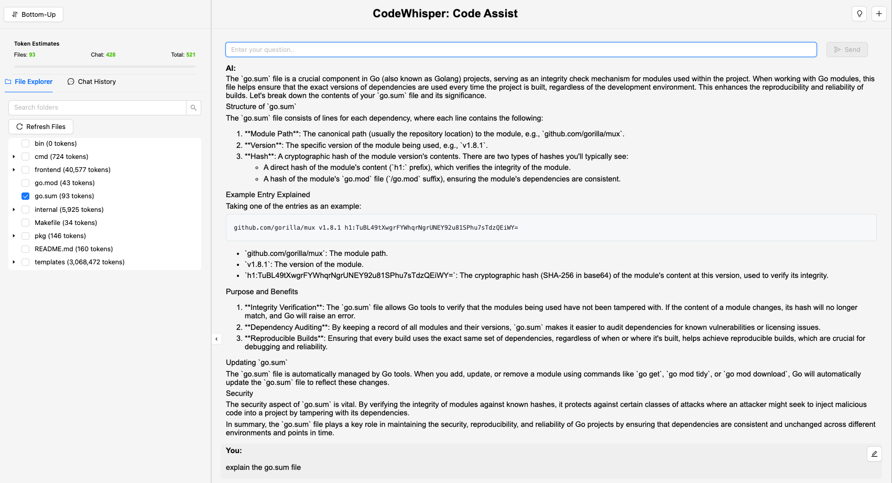

<div align="center">
  <h1>CodeWhisper</h1>
  <p>
    An AI-powered assistant to help developers generate, modify, and understand code.
  </p>

  <p>
    <a href="https://github.com/gongzhen/codewhisper/blob/main/LICENSE"></a>
    <a href="https://github.com/gongzhen/codewhisper/actions"></a>
    <a href="https://www.npmjs.com/package/codewhisper"></a>
  </p>
</div>

---

## 📖 Table of Contents

- [Overview](#-overview)
- [Features](#-features)
- [Screenshot](#-screenshot)
- [Tech Stack](#-tech-stack)
- [Installation](#-installation)
- [Usage](#-usage)
- [Contributing](#-contributing)
- [License](#-license)
- [Contact](#-contact)

##  Overview

CodeWhisper is an AI-powered project designed to assist developers in generating, modifying, and understanding code. It leverages advanced language models to streamline software development tasks, reduce boilerplate, and improve overall productivity.

## ✨ Features

- **Code Generation:** Create functions, classes, and scripts from natural language prompts.
- **Code Modification & Refactoring:** Intelligently refactor or add features to existing code blocks.
- **Intelligent Suggestions:** Receive suggestions for improving code quality, performance, and readability.
- **Multi-Language Support:** Works with popular languages like Python, JavaScript, Java, and more.

## 📸 Screenshot

Here's a look at the CodeWhisper interface in action:


*(Assuming you are using the `screenshot1.png` file from our previous conversation)*

## 🛠️ Tech Stack

- **Backend:** Node.js, Express.js
- **Frontend:** React, Vite, Tailwind CSS
- **AI/ML:** OpenAI API / Hugging Face Transformers
- **Database:** (e.g., PostgreSQL, MongoDB)

## 🚀 Installation

### Prerequisites

Make sure you have the following installed on your system:
- [Node.js](https://nodejs.org/) (v18.x or later)
- [npm](https://www.npmjs.com/) or [yarn](https://yarnpkg.com/)

### Steps

1.  **Clone the repository:**
    ```bash
    git clone [https://github.com/gongzhen/codewhisper.git](https://github.com/gongzhen/codewhisper.git)
    ```
2.  **Navigate to the project directory:**
    ```bash
    cd codewhisper
    ```
3.  **Install dependencies:**
    ```bash
    npm install
    ```

## 💡 Usage

Once the installation is complete, you can run the application.

1.  **Start the development server:**
    ```bash
    npm start
    ```
2.  Open your browser and navigate to `http://localhost:3000`.
3.  Interact with the AI assistant via the user interface.

### Example: Generating a Function

To generate a Python function that calculates a Fibonacci sequence, you could enter the following prompt in the UI:

> "Write a Python function that returns the first n numbers of the Fibonacci sequence."

CodeWhisper will then generate the corresponding code snippet for you to use or modify.

## 🤝 Contributing

We welcome contributions! Please feel free to fork the repository, make changes, and submit a pull request.

1.  Fork the repository.
2.  Create a new branch for your feature or bug fix (`git checkout -b feature/your-feature-name`).
3.  Commit your changes (`git commit -m 'feat: add some amazing feature'`).
4.  Push to the branch (`git push origin feature/your-feature-name`).
5.  Open a pull request.

Please read our `CONTRIBUTING.md` for more details on our code of conduct and the process for submitting pull requests.

## 📄 License

This project is licensed under the MIT License. See the [LICENSE](LICENSE) file for details.

## 📬 Contact

For questions or support, please use the GitHub Issues tracker.
- **GitHub Issues:** [CodeWhisper Issues](https://github.com/gongzhen/codewhisper/issues)
- **Project Lead:** [gongzhen](https://github.com/gongzhen)
